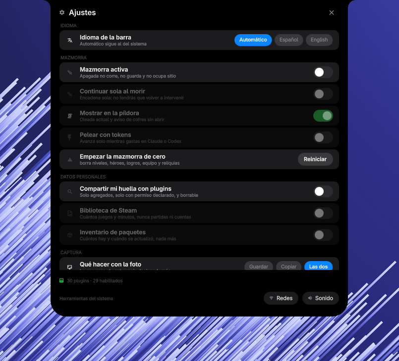
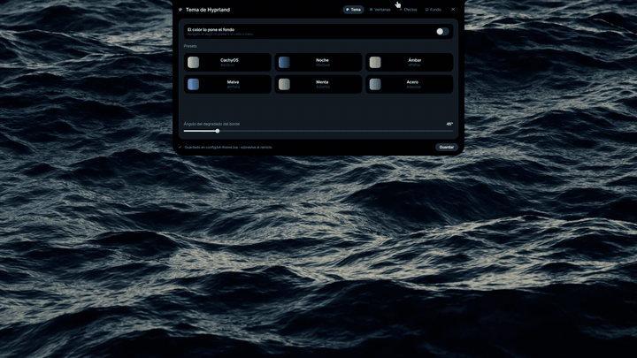

# k4

**A Dynamic Island for Hyprland.** It sits collapsed at the edge of your
screen and expands only when it has something to say. Native host features
provide the core desktop surfaces; installable plugins extend them.

[](https://x.com/k4ditano)
[](LICENSE)
[](https://quickshell.org/)


On Arch Linux with Hyprland, run the installer from this checkout:

```sh
./install --dry-run
./install
```

Installs what is missing, writes the Hyprland
integration, starts the bar, and keeps a checkout at
`~/.config/quickshell/k4` when bootstrapped; an existing checkout is used in place.

The historical upstream bootstrap is still:

```sh
curl -fsSL https://raw.githubusercontent.com/k4ditano/k4/main/instalar | sh
```

That endpoint depends on upstream's historical installer and checkout layout;
it does not install this checkout's filename migration. This checkout uses
`./install` for installation and updates. Piping this checkout's installer
requires `K4_ORIGEN` to point to a repository that already contains `install`.

On Nix, use the flake instead — `nix run github:rukh-debug/k4rk`, a Home
Manager module, or the overlay — same bar, same plugins, updates through
the flake: [k4 on Nix](docs/NIX.md).

> ### Want your own widget? Ask your agent.
>
> k4 installs a skill for coding agents, so Claude Code or Codex already know
> what a k4 plugin looks like, how to test one without restarting your bar,
> and how to publish it. Say *"make me a k4 plugin that shows the train times
> to work"* and it starts from something that already runs.
>
> [How that works ↓](#or-just-ask-your-agent-for-one) · [Publishing yours ↓](#publish-it)

---

## What you get

| | |
|:--:|:--:|
|  |  |
| **Launcher** — apps, package search, install and update. | **Control center** — Wi-Fi, Bluetooth, per-device sound, player. |
|  |  |
| **Wallpapers** — native picker, video and GIF, with a palette extracted from them. | **Every shortcut**, searchable — yours and the ones k4 adds. |

Plus notifications with actions and history, a system tray, clipboard history,
and a bar that lives wherever you put it — top or bottom,
left, center or right. When a Hyprland mode is on, it opens its own island:
every key of the mode as a chip, one press to run it.

### Wallpapers that move, and a palette that comes out of them



The bar draws the wallpaper itself, on its own layer below the windows, so a
wallpaper can be a video or a GIF and not only a picture.

And because k4 is the one drawing it, it can do what a wallpaper daemon cannot:
**pause the video when no window leaves any of it visible.** Measured on a
twelve-core machine, a 1080p60 loop costs about 1.5% of it while you can see it
and next to nothing while you cannot — which matters, because a daemon left to
itself decodes all day for nobody.

One wallpaper per monitor, and a transition when you change it: a crossfade, an
iris that grows out of the island, or a tide that rises from the bottom edge
with a wavy front.

The colour comes from the wallpaper too. k4 pulls a palette out of the image
and hands it to the three places colour shows up — the bar's own tint,
Hyprland's window borders, and the terminal. Pick a preset by hand and it
steps aside. The palette has styles beyond the sampled pick: the Material You
schemes matugen knows — tonal, vibrant, monochrome and the rest — chosen by
a chip in the wallpaper tab.

---

## Native features and plugins

The pill, volume HUD, sound mixer, clock, player, notifications, control
centre and session are native host features: always on, owned by k4 itself.
Everything else — launcher, settings, clipboard, applications and anything
you install — is a plugin. Plugins load in isolation, and a broken one is
recorded with its error while the bar starts without it. Native failures
report through `k4 hostStatus` instead.

### Write one in a minute

```sh
python3 tools/plugins.py --new mi-plugin   # a plugin that already runs
python3 tools/plugins.py --test mi-plugin  # opens it alone, not in your bar
```

`--test` matters more than it sounds: it runs the plugin in its own instance
with no bar, no services and no notifications, so an infinite loop takes down
a test window instead of your desktop.

Then `quickshell ipc -p shell.qml call k4 pluginReload mi-plugin` swaps the
running code for what is on disk, without restarting anything.

### Or just ask your agent for one

> **"Make me a k4 plugin that shows the train times to work."**

That works, and it is the point. k4 installs a skill for coding agents —
`./install` links it into `~/.claude/skills/` and `~/.config/agents/skills/`
— so Claude Code, Codex and anything else that reads those already know:

- that this machine runs k4, with native host features plus installable plugins;
- the shape of a plugin, with the whole starter file in front of them;
- which permissions exist, and that using an undeclared one makes it refuse to load;
- to test with `--test` instead of restarting your bar;
- to read `pluginStatus` when something does not show up.

Without that, an agent asked for "a widget for my bar" starts by guessing.
With it, it starts by running `--new` and editing something that already
works.

```sh
python3 tools/agent_skill.py             # where it is, and whether it's linked
python3 tools/agent_skill.py --install   # link it (./install does this for you)
```

The skill is [`agentes/skills/k4/`](agentes/skills/k4/) — a page on writing a
plugin and a page on driving the bar. It is linked, not copied, so it stays
current when k4 updates.

### Publish it

**1.** Push it to a public repository with a license, and check it passes:

```sh
python3 tools/plugins.py     # the permissions you declare are the ones you use
git rev-parse HEAD           # the SHA you want published
```

**2.** Open the [**Publish a plugin**](../../issues/new?template=publish-plugin.yml)
issue with the repository URL and that full 40-character SHA.

**3.** A bot fetches **that exact commit**, validates it *without running any
of it*, and comments with what the manifest declares, which permissions it
asks for, and anything that tripped a named rule. Fix and edit the issue —
it re-reviews itself.

**4.** A maintainer applies the `publicado` label and it lands in the
registry. The bot never publishes on its own, and even a maintainer's label
will not publish past a blocking rule.

You publish a **commit, not a branch** — a branch moves after it is reviewed,
and then what people install is not what was looked at. New version, new
submission with the new SHA. That is a minute of work and it is what makes
the review mean anything.

### On permissions, honestly

A plugin declares what it uses, and `tools/plugins.py` checks that declaration
against what the QML actually calls — using something undeclared makes the
plugin refuse to load. On top of that, named rules flag patterns that make the
code you run stop being the code someone reviewed: `curl | sh`, passwordless
`sudo`, unpinned clones.

**This is informed consent plus static analysis, not a sandbox.** A plugin
runs inside the bar and can do what the bar can do. Install what you have read
or what you trust — everything above exists to make that judgement possible,
not to remove it.

Full guide: [docs/PLUGINS.md](docs/PLUGINS.md) · API: [docs/API.md](docs/API.md)

---

---

<details>
<summary><b>Shortcuts</b></summary>

Written to `~/.config/hypr/config/k4.lua` (or `k4.conf` on the legacy format).
That file is owned by k4. In the classic format, put overrides after its
include. Lua accumulates bindings, so remove conflicts in your own template
instead; the Nix option is `programs.k4.hyprland.template`. The table below
describes the Lua template; the classic template does not include the terminal
shortcuts.

| Shortcut | Action |
|---|---|
| `SUPER + Space` | Application launcher |
| `SUPER + I` / `SUPER + X` | Control center |
| `SUPER + N` / `SUPER + A` | Notifications |
| `SUPER + Z` | k4 settings |
| `SUPER + Shift + W` | Wallpaper page |
| `SUPER + V` | Clipboard history |
| `SUPER + K` | Shortcut viewer |
| `SUPER + Alt + C` | Session controls, including lock |
| `SUPER + G` | Open the assistant |
| `SUPER + Shift + T` | Terminal in the island (sessions kept alive) |
| `SUPER + Alt + T` | Pop that session out into a window |

</details>

<details>
<summary><b>IPC</b></summary>

```sh
quickshell ipc -p ~/.config/quickshell/k4/shell.qml show   # every target
quickshell ipc -p ~/.config/quickshell/k4/shell.qml call k4 toggleLauncher
```

`show` is the authoritative list — targets come and go with the plugins that
publish them.

| Target | Examples |
|---|---|
| `k4` | `toggleLauncher`, `togglePanel`, `windows`, `settings`, `lock`, `sound` |
| `k4.panel` | `toggle`, `notifications`, `wifi`, `bluetooth`, `sound`, `close` |
| `k4.term` | `open`, `island`, `newSession`, `next`, `prev`, `goTo`, `run`, `move` |

Plugin management: `pluginEnable <id>`, `pluginDisable <id>`,
`pluginToggle <id>`, `pluginReload <id>`, `pluginRefresh`, `pluginStatus`,
`pluginCheck`.

</details>

<details>
<summary><b>Requirements and install options</b></summary>

The installer is the source of truth and reads
[`dependencies.tsv`](dependencies.tsv). The main ones:

| Package | Purpose |
|---|---|
| `quickshell`, `hyprland` | Bar runtime and compositor |
| `python` | Helper tools |
| `qt6-multimedia`, `qt6-multimedia-ffmpeg` | Video/audio preview |
| `grim`, `slurp` | Attach the screen to an Ask question |
| `awww`, `swaybg` | Wallpaper backends — awww for transitions, swaybg as fallback |
| `ffmpeg`, `imagemagick` | Video wallpapers, probing, thumbnails |
| `zenity`, `wl-clipboard`, `fd` | Dialogs, clipboard, search |
| `pactl`, `wpctl`, `nmcli`, `bluez` | Audio, network, Bluetooth |

Optional packages add AUR support, NVIDIA metrics and
Codex integration.

| Option | Effect |
|---|---|
| `--dry-run` | Diagnose without changing anything |
| `--yes` | Do not ask for confirmation |
| `--optional` | Install optional packages too |
| `--no-packages` | Skip package management |
| `--no-restart` | Do not restart the running bar |

The Spanish flags this started with — `--seco`, `--si`, `--opcionales`,
`--sin-paquetes`, `--sin-reiniciar` — still work and are not going away.

**Update with the same script**: `~/.config/quickshell/k4/install`. It pulls
with `--ff-only`, refreshes packages and shortcuts and offers to restart the
bar. With uncommitted changes in the checkout it leaves the code alone and
tells you so — nobody loses work to an update.

**And the bar tells you when there is one.** Settings shows the commit you are
on, and checks in the background — once a minute after start until it manages
to look, then every six hours — whether `origin` has moved. If it has, a pill
in the header says how many commits you are behind and runs the updater for
you. With uncommitted changes it says that instead of offering the button: the
installer would refuse anyway, and a button that does nothing is worse than no
button. `quickshell ipc -p shell.qml call k4.settings version` prints the same
thing as JSON. Start it by hand with
`~/.config/quickshell/k4/launch` — use the wrapper, so the `K4` QML module
resolves.

**[k4term](https://github.com/k4ditano/k4term)** is this project's own
terminal. It is never assumed: the bar looks for `k4term`, then `$TERMINAL`,
then the usual suspects, so everything works the same with any terminal. The
island terminal needs no build either — the Terminal plugin carries
`island.py`, a bundled session core that speaks k4term-isla's protocol over
the python3 k4 already runs on. Install k4term and fresh sessions take the
compiled core on their own; nothing to reconfigure, and sessions already
running keep running.

</details>

<details>
<summary><b>Architecture and contributing</b></summary>

```text
shell.qml       host, arbitration and layer surface
core/           theme tokens, contracts, native views, stateless widgets
api/K4/         public plugin API
services/       persistent domain services, native islands, SurfaceRegistry
features/       native feature catalog (ids, order, metadata)
widgets/        data-driven reusable widgets
plugins/        one directory per installable plugin
agentes/        the skill coding agents read
docs/           API and plugin guides
tools/          helper scripts and validators
hypr/           generated Hyprland integration
```

Dependencies flow `core → services → widgets → plugins`. Plugins never import
each other; references are injected by `SurfaceRegistry`.

Before opening a pull request:

```sh
python3 tools/plugins.py && python3 tools/api.py && python3 tools/docs_check.py
python3 -B tools/test_docs.py
python3 -B tools/test_shortcuts.py
python3 tools/layouts.py && python3 tools/glyphs.py
python3 tools/test_plugins.py && python3 tools/test_text.py
git diff --check
```

Language and naming: write all new prose, comments, UI strings, identifiers,
IPC verbs, plugin IDs, settings keys, permissions and stored values in English.
UI strings are plain English literals; there is no translation layer.

Existing Spanish identifiers, filenames and public `K4.*` names remain until
their coordinated migration. Translate comments first, preserving their full
explanations, then migrate identifiers and paths in reviewable batches; public
API names come last. Do not rename contracts opportunistically while doing
unrelated work. Update callers, persisted-state migrations and documentation
together, and keep the validators green. Existing compatibility aliases remain
supported during that transition, then move out of the maintained source with
the archived migration release/tool. The approved target is strict final removal,
not permanent bilingual interfaces. See the [migration ledger](docs/ENGLISH-MIGRATION.md)
for scope, ordering, completion gates and current progress.

k4term's own configuration keys and shell-integration markers are external
contracts: preserve compatibility at the integration boundary. The bundled
terminal and this repository's migration do not require a separate k4term checkout.
Preserve source identities and license notices.

More: [docs/API.md](docs/API.md) · [docs/PLUGINS.md](docs/PLUGINS.md) ·
[api/README.md](api/README.md)

</details>

---

MIT.
