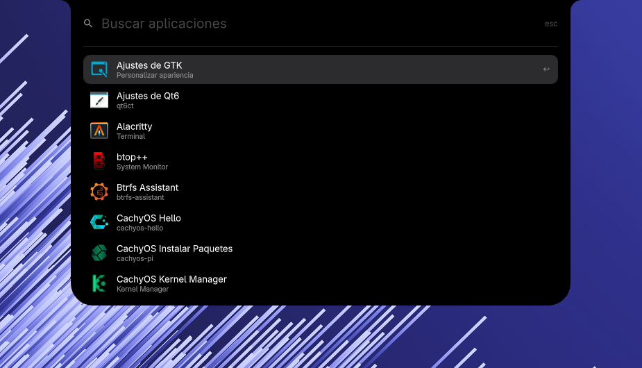
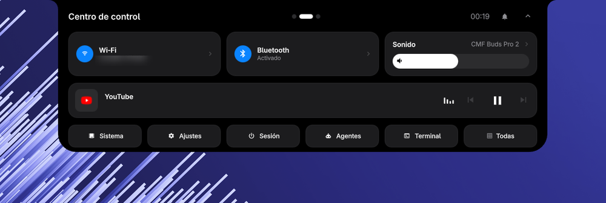
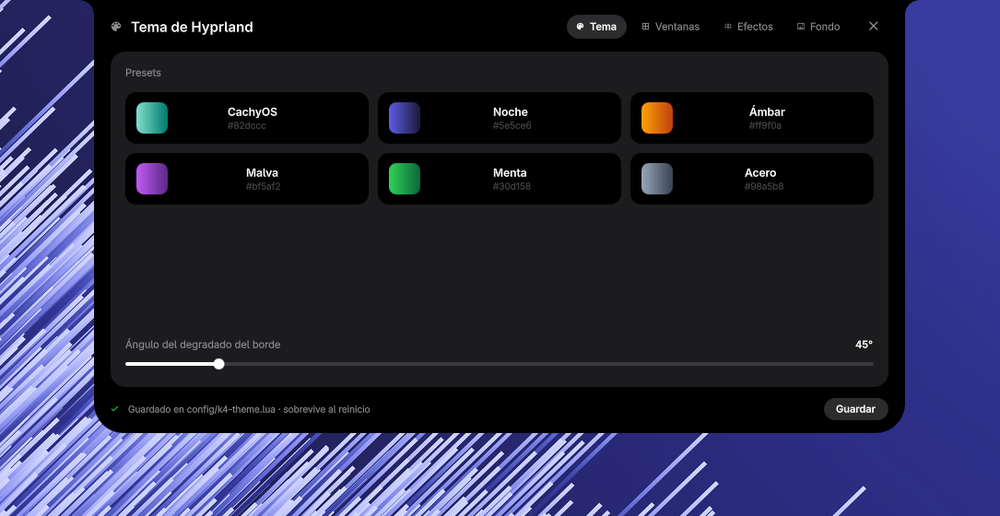
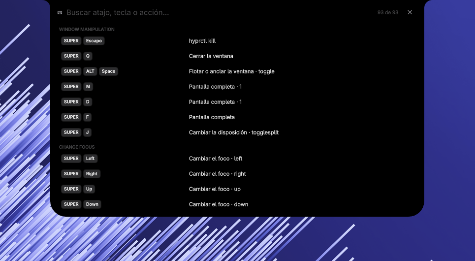
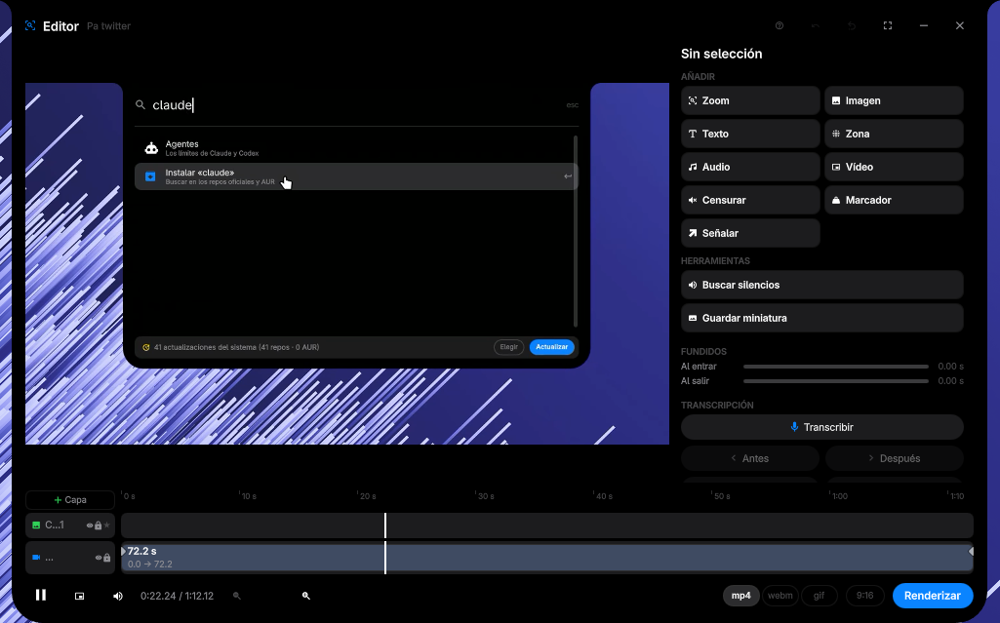
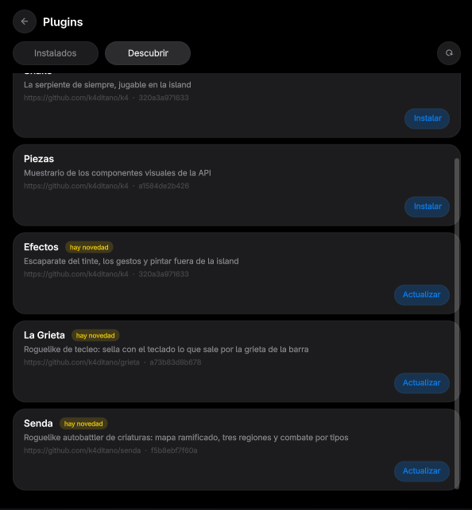
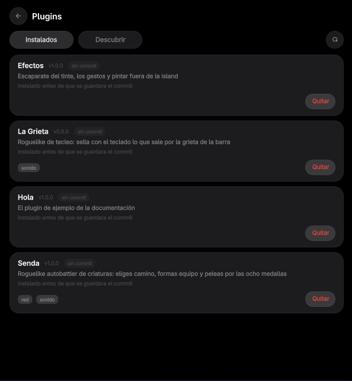

# k4

**A Dynamic Island for Hyprland.** It sits collapsed at the edge of your
screen and expands only when it has something to say — and everything it does,
including the parts that look built in, is a plugin.

[](https://x.com/k4ditano)
[](LICENSE)
[](https://quickshell.org/)


```sh
curl -fsSL https://raw.githubusercontent.com/k4ditano/k4/main/instalar | sh
```

Arch Linux and Hyprland. Installs what is missing, writes the Hyprland
integration, starts the bar, and keeps a checkout at
`~/.config/quickshell/k4`. Run `./instalar --seco` first if you would rather
see what it would do.

---

## What you get

| | |
|:--:|:--:|
|  |  |
| **Launcher** — apps, package search, install and update. | **Control center** — Wi-Fi, Bluetooth, per-device sound, player. |
|  |  |
| **Hyprland's theme**, live — colors, gaps, borders, blur, animations. | **Every shortcut**, searchable — yours and the ones k4 adds. |

Plus notifications with actions and history, a system tray, clipboard history,
a window switcher, and a bar that lives wherever you put it — top or bottom,
left, center or right.

### Capture, and an editor that is not a separate app



Region, window or screen; record; then land straight in a non-linear editor.
Layered video and image timelines, cuts, crops, audio tracks with ducking and
live noise removal, subtitles, camera overlay, silence detection, Whisper
transcription. Out the other side: MP4, WebM, GIF or 9:16 for Shorts.

---

## Plugins

The clock is a plugin. So is the launcher, the control center, the capture
tool. There is no privileged inner circle — **the API a stranger's plugin gets
is the API the launcher uses.** Plugins load in isolation, and a broken one is
recorded with its error while the bar starts without it.

### Install one from the bar

<table>
<tr>
<td width="50%"></td>
<td width="50%"></td>
</tr>
<tr>
<td><b>Discover</b> — what is published, with the commit each entry pins.</td>
<td><b>Installed</b> — what you have, where it came from, what it asked for.</td>
</tr>
</table>

Installing shows you what the plugin declares, where it came from and **which
commit** — and installs that exact commit, so a branch moving while you read
cannot change what lands. From the terminal:

```sh
python3 tools/plugins.py --buscar          # what's published
python3 tools/plugins.py --instalar <url> --commit <sha>
python3 tools/plugins.py --comprobar       # what of yours has something newer
```

### Write one in a minute

```sh
python3 tools/plugins.py --nuevo mi-plugin   # a plugin that already runs
python3 tools/plugins.py --probar mi-plugin  # opens it alone, not in your bar
```

`--probar` matters more than it sounds: it runs the plugin in its own instance
with no bar, no services and no notifications, so an infinite loop takes down
a test window instead of your desktop.

Then `quickshell ipc -p shell.qml call k4 pluginReload mi-plugin` swaps the
running code for what is on disk, without restarting anything.

### Or have an agent write it

k4 ships a skill for coding agents. `./instalar` links it into
`~/.claude/skills/` and `~/.config/agents/skills/`, so Claude Code, Codex and
anything else that reads those will already know they are on a k4 machine,
what the API looks like, which permissions exist and how to test a plugin
without restarting your bar.

```sh
python3 tools/agente.py            # where it is, and whether it's linked
python3 tools/agente.py --instalar # link it
```

Then just ask: *"make me a k4 plugin that shows the train times to work."*

### Publish it

Open the **Publish a plugin** issue with your repository and a full commit
SHA. A bot fetches that exact commit, validates it **without running any of
it**, and comments with what the manifest declares, which permissions it asks
for, and anything that tripped a named rule. A maintainer signs off; the bot
never publishes on its own.

### On permissions, honestly

A plugin declares what it uses, and `tools/plugins.py` checks that declaration
against what the QML actually calls — using something undeclared makes the
plugin refuse to load. On top of that, named rules flag patterns that make the
code you run stop being the code someone reviewed: `curl | sh`, passwordless
`sudo`, unpinned clones.

**This is informed consent plus static analysis, not a sandbox.** A plugin
runs inside the bar and can do what the bar can do. Install what you have read
or what you trust — everything above exists to make that judgement possible,
not to remove it.

Full guide: [docs/PLUGINS.md](docs/PLUGINS.md) · API: [docs/API.md](docs/API.md)

---

## Games, as ordinary plugins

Not special cases — the same contract as everything else. An idle roguelite, a
typing roguelike, an autobattler, and
[Digivice](https://github.com/k4ditano/digivice): a virtual pet whose road
advances on how you actually use the computer, reading nothing but *that* a
window changed.

---

<details>
<summary><b>Shortcuts</b></summary>

Written to `~/.config/hypr/config/k4.lua` (or `k4.conf` on the legacy format).
That file is owned by k4; put your overrides after it.

| Shortcut | Action |
|---|---|
| `SUPER + Space` | Application launcher |
| `SUPER + I` / `SUPER + X` | Control center |
| `SUPER + N` / `SUPER + A` | Notifications |
| `SUPER + Z` | k4 settings |
| `SUPER + Tab` | Window switcher |
| `SUPER + Shift + W` | Hyprland theme |
| `SUPER + V` | Clipboard history |
| `SUPER + B` | File browser |
| `SUPER + K` | Shortcut viewer |
| `SUPER + L` | Lock screen |
| `SUPER + G` | Ask Codex |
| `SUPER + C` | Capture a region |
| `SUPER + Shift + C` | Start/stop recording |
| `SUPER + Shift + E` | Open the video editor |
| `SUPER + Shift + T` | Terminal in the island (sessions kept alive) |
| `SUPER + Alt + T` | Pop that session out into a window |
| `Print` / `Shift + Print` / `Ctrl + Print` | Region / screen / window capture |

</details>

<details>
<summary><b>IPC</b></summary>

```sh
quickshell ipc -p ~/.config/quickshell/k4/shell.qml show   # every target
quickshell ipc -p ~/.config/quickshell/k4/shell.qml call k4 toggleLauncher
```

`show` is the authoritative list — targets come and go with the plugins that
publish them.

| Target | Examples |
|---|---|
| `k4` | `toggleLauncher`, `togglePanel`, `windows`, `settings`, `lock` |
| `k4.panel` | `toggle`, `notifications`, `wifi`, `bluetooth`, `close` |
| `k4.theme` | `toggle`, `tab`, `preset`, `wallpaper`, `apply`, `save` |
| `k4.captura` | `menu`, `region`, `grabar`, `parar`, `grande` |
| `k4.editor` | `abrir`, `editar`, `retomar`, `imagen`, `formato`, `silencios` |
| `k4.term` | `isla`, `nueva`, `siguiente`, `anterior`, `irA`, `ejecutar` |

Plugin management: `pluginEnable <id>`, `pluginDisable <id>`,
`pluginToggle <id>`, `pluginReload <id>`, `pluginRefresh`, `pluginStatus`,
`pluginCheck`.

</details>

<details>
<summary><b>Requirements and install options</b></summary>

The installer is the source of truth and reads
[`dependencias.tsv`](dependencias.tsv). The main ones:

| Package | Purpose |
|---|---|
| `quickshell`, `hyprland` | Bar runtime and compositor |
| `python` | Helper tools |
| `qt6-multimedia`, `qt6-multimedia-ffmpeg` | Video/audio preview |
| `grim`, `slurp`, `satty` | Capture, region selection, annotation |
| `wf-recorder` | Screen recording |
| `swaybg` | Wallpaper backend |
| `ffmpeg`, `imagemagick` | Editing, probing, thumbnails |
| `zenity`, `wl-clipboard`, `fd` | Dialogs, clipboard, search |
| `pactl`, `wpctl`, `nmcli`, `bluez` | Audio, network, Bluetooth |

Optional packages add Whisper transcription, AUR support, NVIDIA metrics and
Codex integration.

| Option | Effect |
|---|---|
| `--seco` | Diagnose without changing anything |
| `--si` | Do not ask for confirmation |
| `--opcionales` | Install optional packages too |
| `--sin-paquetes` | Skip package management |
| `--sin-reiniciar` | Do not restart the running bar |

Update with `~/.config/quickshell/k4/instalar`. Start it by hand with
`~/.config/quickshell/k4/arrancar` — use the wrapper, so the `K4` QML module
resolves.

**[k4term](https://github.com/k4ditano/k4term)** is this project's own
terminal. It is never assumed: the bar looks for `k4term`, then `$TERMINAL`,
then the usual suspects, so everything works the same with any terminal. If
k4term shows up later the bar notices within a minute and the island terminal
turns itself on.

</details>

<details>
<summary><b>Architecture and contributing</b></summary>

```text
shell.qml       host, arbitration and layer surface
core/           theme tokens, the K4Plugin contract, stateless widgets
api/K4/         public plugin API
services/       persistent domain services and singletons
widgets/        data-driven reusable widgets
plugins/        one directory per built-in plugin
agentes/        the skill coding agents read
docs/           API, plugin and game guides
tools/          helper scripts and validators
hypr/           generated Hyprland integration
```

Dependencies flow `core → services → widgets → plugins`. Plugins never import
each other; references are injected by `shell.qml`.

Before opening a pull request:

```sh
python3 tools/plugins.py && python3 tools/api.py && python3 tools/guia.py
python3 tools/layouts.py && python3 tools/glifos.py
python3 tools/prueba_editar.py && python3 tools/prueba_plugins.py
python3 tools/prueba_rutas.py && python3 tools/prueba_texto.py
git diff --check
```

Naming: the `K4Plugin` contract keeps its English members (`open`, `close`,
`toggle`, `active`, `view`); everything else — services, properties, functions,
signals — is Spanish, which is the project's voice. Do not add a third variant
of an existing pair: if a file already has `abrir()`/`cerrar()`, extend that.
The codebase predates the rule, so migrate names when you touch them, never in
bulk.

More: [docs/API.md](docs/API.md) · [docs/PLUGINS.md](docs/PLUGINS.md) ·
[docs/GAMES.md](docs/GAMES.md) · [api/LEEME.md](api/LEEME.md)

</details>

---

MIT. Spanish UI with translation files in [`traducciones/`](traducciones/) —
English and Russian included.
